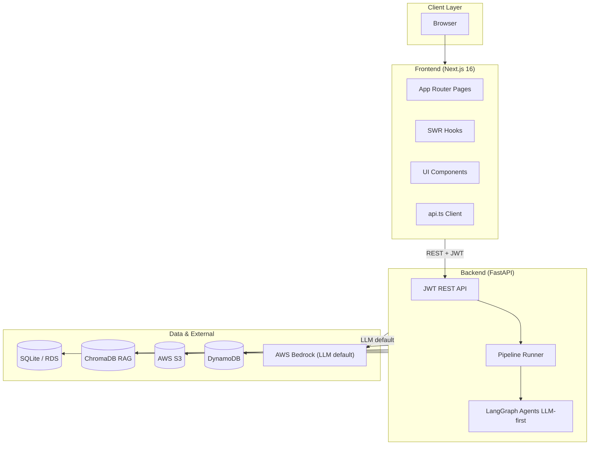
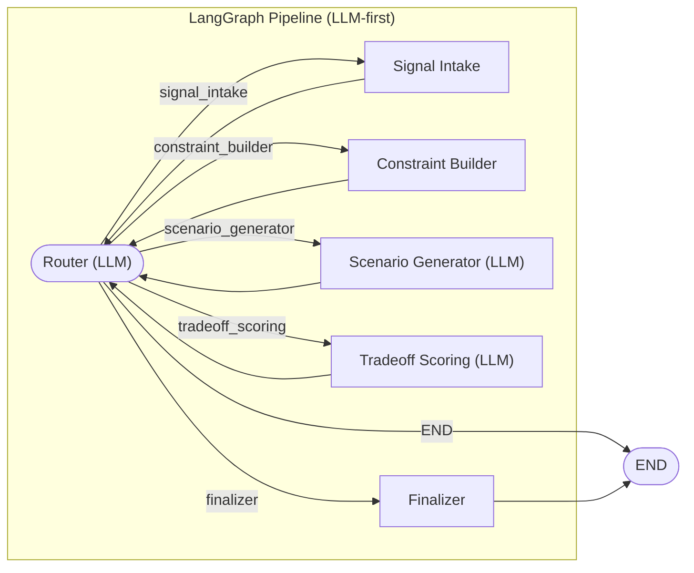
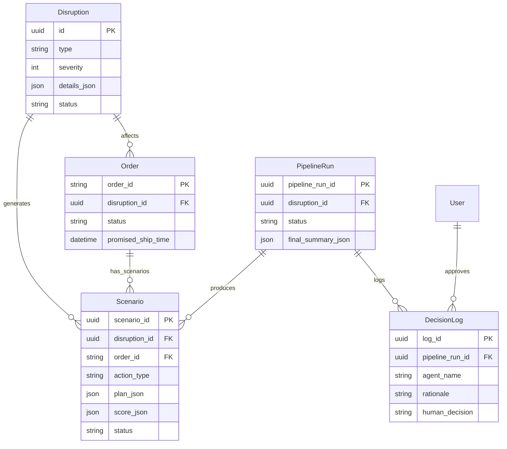
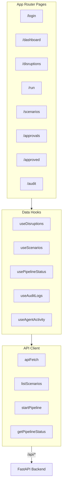
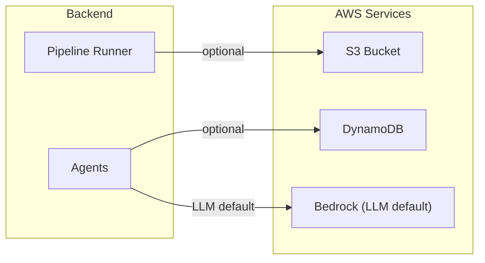
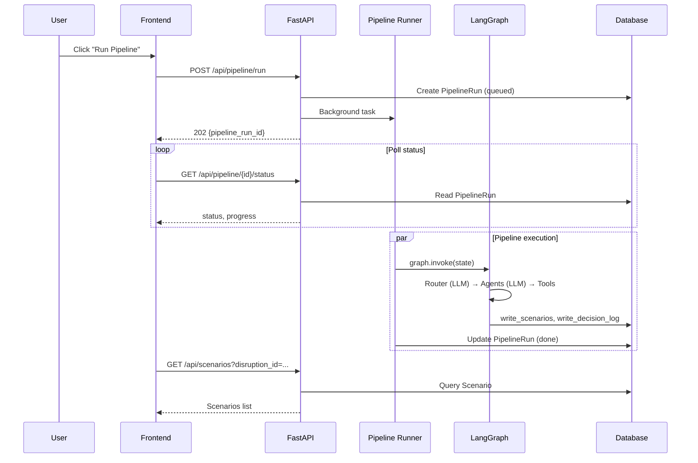
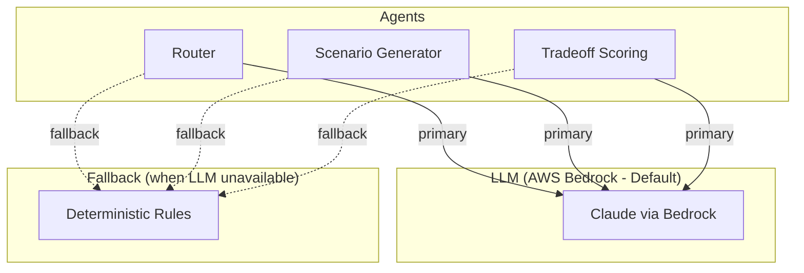

# X-Tern Agents – Architecture Diagram

Multi-agent disruption response planner built with FastAPI, LangGraph, and Next.js. **LLM (AWS Bedrock) is the default** for routing, scenario generation, and tradeoff scoring; deterministic rules provide fallback when LLM is unavailable. Diagrams use [Mermaid](https://mermaid.js.org/) and render in GitHub, VS Code, and most markdown viewers.

---

## 1. System Context

High-level view of system components and external integrations.



---

## 2. Backend Layers

```mermaid
flowchart TB
    subgraph API["API Routes"]
        auth[/auth]
        disruptions[/disruptions]
        pipeline[/pipeline]
        scenarios[/scenarios]
        audit[/audit-logs]
        dashboard[/dashboard]
        governance[/governance]
        rag[/rag]
    end

    subgraph Services["Services"]
        pipeline_runner[Pipeline Runner]
        execution_engine[Execution Engine]
    end

    subgraph Agents["LangGraph Agents (LLM default)"]
        router["Router (LLM)"]
        signal[Signal Intake]
        constraint[Constraint Builder]
        scenario["Scenario Generator (LLM)"]
        tradeoff["Tradeoff Scoring (LLM)"]
        finalizer[Finalizer]
    end

    subgraph Tools["MCP / Tools"]
        read[read_*]
        write[write_scenarios, write_decision_log]
        update[update_scenario_scores]
    end

    subgraph Persistence["Persistence"]
        SQL[(SQLAlchemy)]
    end

    API --> pipeline_runner
    pipeline_runner --> Agents
    Agents --> Tools
    Tools --> SQL
```

**LLM usage:** Router, Scenario Generator, and Tradeoff Scoring use AWS Bedrock (Claude) by default. Rules-based fallback runs when `USE_AWS=0` or Bedrock is unavailable.

---

## 3. Pipeline Flow (LangGraph)

Router-driven orchestration with **LLM as default** for routing decisions. Each domain agent returns to the Router; the Router (LLM or fallback rules) decides the next step or routes to the Finalizer.



**State flow:**
- `signal` → `constraints` → `scenarios` → `scores` → `final_summary`
- Routing metadata: `step_count`, `max_steps`, `needs_review`, `routing_trace`
- LLM agents: Router, Scenario Generator, Tradeoff Scoring (fallback: deterministic rules)

---

## 4. Data Model (Core Entities)



---

## 5. Frontend Structure



---

## 6. AWS Integration



| Service   | Purpose                          | Config              | When          |
|----------|-----------------------------------|---------------------|---------------|
| Bedrock  | LLM (routing, scenarios, scoring, explanation) | `BEDROCK_MODEL_ID`  | Default when `USE_AWS=1` |
| S3       | Pipeline run JSON (summary + scenarios) | `S3_BUCKET_NAME`    | When `USE_AWS=1` |
| DynamoDB | Per-step pipeline status          | `DYNAMO_STATUS_TABLE` | When `USE_AWS=1` |
| RDS      | Production PostgreSQL             | `DATABASE_URL`      | Optional       |

---

## 7. Request Flow (Run Pipeline)



---

## 8. Project Layout

```
X-Tern Agents/
├── backend/
│   ├── app/
│   │   ├── api/routes/      # FastAPI routers
│   │   ├── agents/          # LangGraph nodes
│   │   ├── aws/             # S3, DynamoDB, Bedrock
│   │   ├── core/            # config, deps, security
│   │   ├── db/               # models, session
│   │   ├── governance/       # TRiSM
│   │   ├── mcp/              # tools, tool_router
│   │   ├── rag/              # ChromaDB knowledge base
│   │   └── services/        # pipeline_runner, execution_engine
│   ├── scripts/             # e2e, verify, seed
│   └── main.py
├── frontend/
│   └── src/
│       ├── app/              # Next.js App Router pages
│       ├── components/       # shared + ui
│       ├── hooks/            # useScenarios, usePipelineStatus, etc.
│       └── lib/              # api, auth, types
├── docs/
├── infra/
└── Makefile
```

---

## 9. LLM-First Architecture



**Configuration:** Set `USE_AWS=1`, `BEDROCK_MODEL_ID`, and AWS credentials. Without them, agents use rules-based fallback automatically.

---

*Generated for X-Tern Agents. LLM (Bedrock) is the default. View in GitHub or any Mermaid-compatible markdown viewer.*
