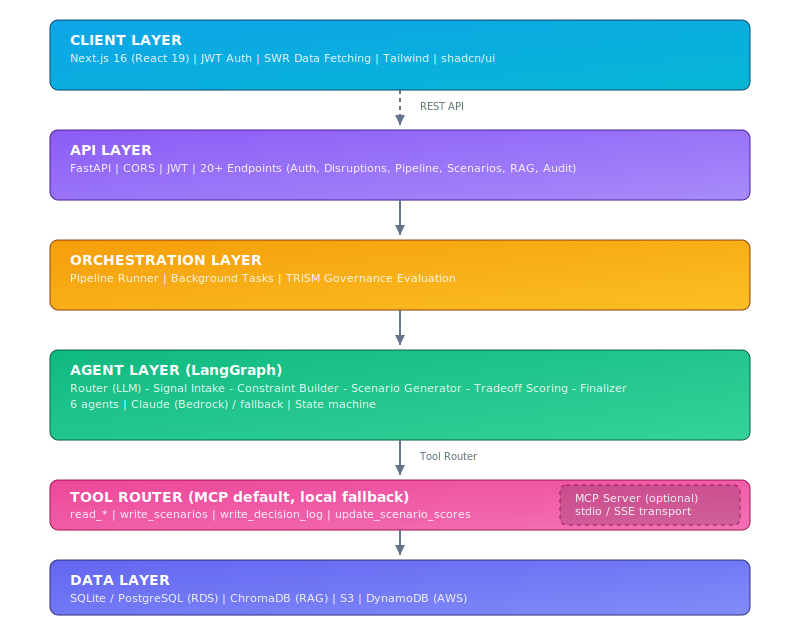
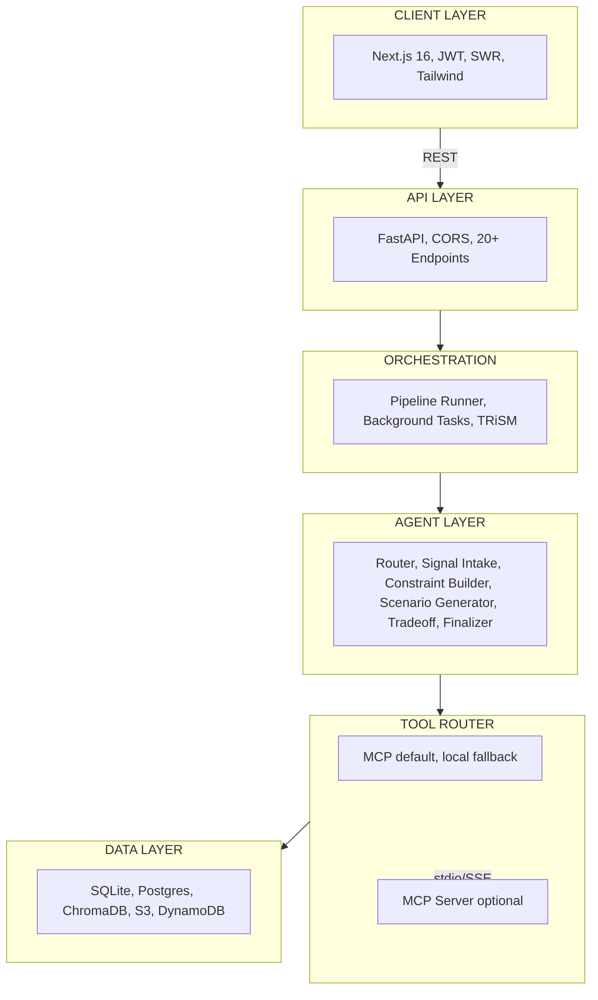

# Technical Design Document

**X-Tern Agents – Disruption Response Planner**  
**Version:** 1.1  
**Last Updated:** March 2026

---

## 1. Executive Summary

The X-Tern Agents system is an AI-native disruption response planner for warehouse operations. It uses a multi-agent LangGraph pipeline to ingest disruption signals, analyze constraints, generate response scenarios, and score tradeoffs—all with human-in-the-loop approval and full audit trails.

---

## 2. System Architecture

### 2.1 High-Level Architecture



**Mermaid source** (for platforms that render Mermaid):



**ASCII diagram:**

```
┌─────────────────────────────────────────────────────────────────────────┐
│                          CLIENT LAYER                                    │
│  Next.js 16 Frontend (React 19) • JWT Auth • SWR Data Fetching          │
└────────────────────────────────┬────────────────────────────────────────┘
                                 │ REST API
┌────────────────────────────────▼────────────────────────────────────────┐
│                          API LAYER                                       │
│  FastAPI • CORS • JWT Validation • 20+ Endpoints                         │
└────────────────────────────────┬────────────────────────────────────────┘
                                 │
┌────────────────────────────────▼────────────────────────────────────────┐
│                     ORCHESTRATION LAYER                                  │
│  Pipeline Runner • Background Tasks • TRiSM Governance Evaluation        │
└────────────────────────────────┬────────────────────────────────────────┘
                                 │
┌────────────────────────────────▼────────────────────────────────────────┐
│                     AGENT LAYER (LangGraph)                              │
│  Router (LLM-driven) → Signal Intake → Constraint Builder               │
│  → Scenario Generator → Tradeoff Scoring → Finalizer                     │
└────────────────────────────────┬────────────────────────────────────────┘
                                 │ Tool Router (MCP default, local fallback)
┌────────────────────────────────▼────────────────────────────────────────┐
│                     DATA LAYER                                           │
│  SQLite / PostgreSQL (RDS) • ChromaDB (RAG) • S3 • DynamoDB (AWS)       │
└─────────────────────────────────────────────────────────────────────────┘
```

### 2.2 Component Diagram

| Layer | Components | Technology |
|-------|------------|------------|
| Frontend | Dashboard, Disruptions, Scenarios, Approvals, Run Planner, Audit Log | Next.js 16, TypeScript, Tailwind, shadcn/ui |
| API | Auth, Disruptions, Pipeline, Scenarios, Audit, RAG, Dashboard | FastAPI, Pydantic |
| Pipeline | LangGraph state machine, 6 nodes, LLM router | LangGraph, LangChain |
| Agents | Signal Intake, Constraint Builder, Scenario Generator, Tradeoff Scoring, Finalizer, Router | Python, MCP tools |
| Data | SQLAlchemy ORM, ChromaDB collections | SQLite/PostgreSQL, Chroma |

---

## 3. Data Model

### 3.1 Core Entities

- **Disruption**: Supply chain event (late_truck, stockout, machine_down). Fields: id, type, severity, timestamp, details_json, status.
- **Order**: Customer order with lines. Fields: order_id, priority, promised_ship_time, cutoff_time, dc, status.
- **Scenario**: Proposed response per order. Fields: scenario_id, disruption_id, order_id, action_type, plan_json, score_json, status (pending/approved/rejected).
- **DecisionLog**: Audit trail entry. Fields: log_id, pipeline_run_id, agent_name, input_summary, output_summary, confidence_score, rationale, human_decision, approver_id, approver_note.
- **PipelineRun**: Execution tracking. Fields: pipeline_run_id, disruption_id, status, current_step, progress, final_summary_json.

### 3.2 Supporting Tables

- **Inventory**, **OrderLine**, **InboundShipment**, **Capacity**, **Substitution**, **User**

---

## 4. Multi-Agent Pipeline

### 4.1 Graph Structure

```
                    ┌─────────────┐
                    │   router    │  ← Entry point (LLM-driven or deterministic)
                    └──────┬──────┘
                           │
         ┌─────────────────┼─────────────────┐
         │                 │                 │
         ▼                 ▼                 ▼
┌────────────────┐ ┌────────────────┐ ┌────────────────┐
│ signal_intake  │ │constraint_builder│ │scenario_generator│
└───────┬────────┘ └───────┬────────┘ └───────┬────────┘
        │                  │                  │
        └──────────────────┼──────────────────┘
                           │
                           ▼
                   ┌───────────────┐
                   │ tradeoff_    │
                   │ scoring      │
                   └───────┬──────┘
                           │
                           ▼
                   ┌───────────────┐
                   │  finalizer   │  → END
                   └───────────────┘
```

### 4.2 Agent Responsibilities

| Agent | Input | Output |
|-------|-------|--------|
| **Signal Intake** | disruption_id | Normalized signal with impacted_order_ids |
| **Constraint Builder** | Signal | Inventory, capacity, substitutions per DC |
| **Scenario Generator** | Signal + constraints | 3–5 scenarios per impacted order |
| **Tradeoff Scoring** | Scenarios | Scored scenarios (cost, SLA risk, labor) |
| **Router** | Pipeline state | Next step or finalizer |
| **Finalizer** | All state | Unified summary, KPIs, decision logs |

### 4.3 LLM Routing

- Router uses Claude (AWS Bedrock) when `USE_AWS=1`.
- Fallback: deterministic routing based on prerequisites.
- Routing trace stored in final_summary for debugging.

---

## 5. API Design

### 5.1 Key Endpoints

| Method | Path | Purpose |
|--------|------|---------|
| POST | /api/auth/login | JWT authentication |
| GET | /api/disruptions | List disruptions (filter by status) |
| POST | /api/disruptions | Create disruption |
| PATCH | /api/disruptions/{id} | Update disruption status |
| POST | /api/pipeline/run | Start pipeline for disruption |
| GET | /api/pipeline/{id}/status | Poll pipeline status |
| GET | /api/scenarios | List scenarios |
| POST | /api/scenarios/{id}/approve | Approve scenario |
| POST | /api/scenarios/{id}/reject | Reject scenario |
| GET | /api/audit-logs | Decision log query |
| GET | /api/rag/stats | RAG collection stats |

---

## 6. MCP Architecture

- **MCP Server**: Standalone process (`python scripts/run_mcp_server.py`) exposing tools via stdio or SSE.
- **Tool Router** (`app.mcp.tool_router`): Single choke point—agents call plain functions (e.g. `read_disruption(id)`). When `USE_MCP_SERVER=1` (default), routes to MCP client; otherwise local tools. **Automatic fallback**: If MCP package is not installed or the server is unreachable, falls back to local tools so the pipeline never fails.
- **Tools**: read_disruption, read_open_orders, read_inbound_status, read_inventory, read_capacity, read_substitutions, write_scenarios, write_decision_log, update_scenario_scores. Pipeline tools (create/update_pipeline_run) always run locally.

---

## 7. RAG Design

- **Collections**: disruptions, decisions, domain_knowledge, scenarios.
- **Embedding**: Default sentence-transformers (all-MiniLM-L6-v2); replaceable with Bedrock embeddings.
- **Context**: `get_context_for_agent()` combines similar_disruptions, relevant_decisions, domain_knowledge.

---

## 8. Security & Auth

- JWT with HS256; roles: warehouse_manager, analyst.
- Manager: approve/reject scenarios; Analyst: view-only.
- CORS origins configurable; PII redaction in AgentSecurityGuard.

---

## 9. Deployment Considerations

- **Frontend**: Vercel (Next.js static/SSR).
- **Backend**: Railway, Render, Fly.io, or EC2 (long-running pipeline, SQLite/Postgres).
- **Database**: PostgreSQL (RDS) for production; SQLite for local dev.
- **AWS**: Optional S3 (pipeline results), DynamoDB (status), Bedrock (LLM).
